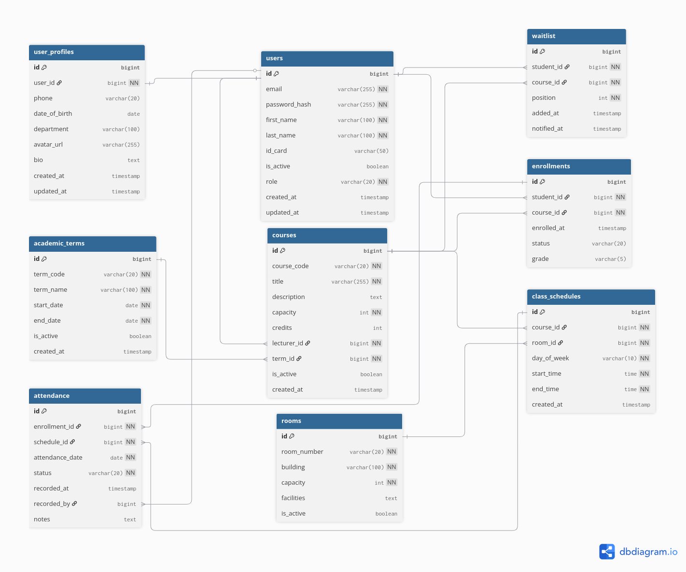

# **UPDATED CARDINALITY, RELATIONSHIPS & CONSTRAINTS**

## **COMPLETE CARDINALITY MATRIX**

| Parent Table | Child Table | Relationship Type | Cardinality | Foreign Key | Description |
|--------------|-------------|-------------------|-------------|-------------|-------------|
| **roles** | **users** | One-to-Many | 1:N | `users.role_id → roles.id` | One role → Many users |
| **users** | **user_profiles** | One-to-One | 1:1 | `user_profiles.user_id → users.id` | Each user has one profile |
| **courses** | **course_offerings** | One-to-Many | 1:N | `course_offerings.course_id → courses.id` | Course → Many term offerings |
| **academic_terms** | **course_offerings** | One-to-Many | 1:N | `course_offerings.term_id → academic_terms.id` | Term → Many course offerings |
| **course_offerings** | **course_lecturers** | One-to-Many | 1:N | `course_lecturers.offering_id → course_offerings.id` | Offering → Many lecturer assignments |
| **users** (lecturers) | **course_lecturers** | One-to-Many | 1:N | `course_lecturers.lecturer_id → users.id` | Lecturer → Many course assignments |
| **users** (students) | **enrollments** | One-to-Many | 1:N | `enrollments.student_id → users.id` | Student → Many enrollments |
| **course_offerings** | **enrollments** | One-to-Many | 1:N | `enrollments.offering_id → course_offerings.id` | Offering → Many enrollments |
| **users** (students) | **waitlist** | One-to-Many | 1:N | `waitlist.student_id → users.id` | Student → Many waitlist entries |
| **course_offerings** | **waitlist** | One-to-Many | 1:N | `waitlist.offering_id → course_offerings.id` | Offering → Many waitlisted students |
| **course_offerings** | **class_schedules** | One-to-Many | 1:N | `class_schedules.offering_id → course_offerings.id` | Offering → Many schedules |
| **rooms** | **class_schedules** | One-to-Many | 1:N | `class_schedules.room_id → rooms.id` | Room → Many scheduled classes |
| **enrollments** | **attendance** | One-to-Many | 1:N | `attendance.enrollment_id → enrollments.id` | Enrollment → Many attendance records |
| **class_schedules** | **attendance** | One-to-Many | 1:N | `attendance.schedule_id → class_schedules.id` | Schedule → Many attendance records |
| **users** | **attendance** (recorded_by) | One-to-Many | 1:N | `attendance.recorded_by → users.id` | User → Many recorded attendance |

## **COMPLETE CONSTRAINT SUMMARY**

### **PRIMARY KEYS (All auto-increment):**
- `roles.id`, `users.id`, `user_profiles.id`, `academic_terms.id`, `courses.id`
- `course_offerings.id`, `course_lecturers.id`, `enrollments.id`, `waitlist.id`
- `rooms.id`, `class_schedules.id`, `attendance.id`

### **UNIQUE CONSTRAINTS:**

| Table | Unique Constraint | Purpose |
|-------|------------------|---------|
| **roles** | `role_code` | Unique role codes |
| **users** | `email` | No duplicate emails |
| **users** | `id_card` | Unique student/lecturer IDs |
| **user_profiles** | `user_id` | One profile per user |
| **academic_terms** | `term_code` | Unique term codes |
| **courses** | `course_code` | Unique course codes |
| **course_offerings** | `(course_id, term_id)` | **CHANGED**: One offering per course per term (no sections) |
| **course_lecturers** | `(offering_id, lecturer_id)` | No duplicate lecturer assignments |
| **enrollments** | `(student_id, offering_id)` | No duplicate enrollments |
| **waitlist** | `(student_id, offering_id)` | No duplicate waitlist entries |
| **rooms** | `room_number` | Unique room numbers |
| **class_schedules** | `(room_id, day_of_week, start_time, end_time)` | Prevent room double-booking |
| **attendance** | `(enrollment_id, schedule_id, attendance_date)` | One attendance per student per class per day |

### **FOREIGN KEY CONSTRAINTS:**

| Child Table | Foreign Key | References | Required? | Notes |
|-------------|-------------|------------|-----------|-------|
| **users** | `role_id` | `roles.id` | ✅ NOT NULL | Every user must have a role |
| **user_profiles** | `user_id` | `users.id` | ✅ NOT NULL, UNIQUE | 1:1 relationship |
| **course_offerings** | `course_id` | `courses.id` | ✅ NOT NULL | Offering belongs to a course |
| **course_offerings** | `term_id` | `academic_terms.id` | ✅ NOT NULL | Offering in a specific term |
| **course_lecturers** | `offering_id` | `course_offerings.id` | ✅ NOT NULL | Assignment to specific offering |
| **course_lecturers** | `lecturer_id` | `users.id` | ✅ NOT NULL | Must be a valid user |
| **enrollments** | `student_id` | `users.id` | ✅ NOT NULL | Must be a valid student |
| **enrollments** | `offering_id` | `course_offerings.id` | ✅ NOT NULL | Enrollment in specific offering |
| **waitlist** | `student_id` | `users.id` | ✅ NOT NULL | Must be a valid student |
| **waitlist** | `offering_id` | `course_offerings.id` | ✅ NOT NULL | Waitlist for specific offering |
| **class_schedules** | `offering_id` | `course_offerings.id` | ✅ NOT NULL | Schedule for specific offering |
| **class_schedules** | `room_id` | `rooms.id` | ✅ NOT NULL | Must be a valid room |
| **attendance** | `enrollment_id` | `enrollments.id` | ✅ NOT NULL | Attendance for specific enrollment |
| **attendance** | `schedule_id` | `class_schedules.id` | ✅ NOT NULL | Attendance for specific schedule |
| **attendance** | `recorded_by` | `users.id` | ❌ NULLABLE | Optional - who marked attendance |

### **NOT NULL CONSTRAINTS:**

| Table | NOT NULL Columns |
|-------|------------------|
| **roles** | `role_code`, `role_name` |
| **users** | `email`, `password_hash`, `first_name`, `last_name`, `role_id` |
| **user_profiles** | `user_id` |
| **academic_terms** | `term_code`, `term_name`, `start_date`, `end_date` |
| **courses** | `course_code`, `title`, `credits` |
| **course_offerings** | `course_id`, `term_id`, `capacity` |
| **course_lecturers** | `offering_id`, `lecturer_id` |
| **enrollments** | `student_id`, `offering_id` |
| **waitlist** | `student_id`, `offering_id`, `position` |
| **rooms** | `room_number`, `building`, `capacity` |
| **class_schedules** | `offering_id`, `room_id`, `day_of_week`, `start_time`, `end_time` |
| **attendance** | `enrollment_id`, `schedule_id`, `attendance_date`, `status` |

### **DEFAULT VALUES:**

| Table | Column | Default Value | Purpose |
|-------|--------|---------------|---------|
| **users** | `is_active` | `true` | Active users by default |
| **academic_terms** | `is_active` | `true` | Active terms by default |
| **courses** | `credits` | `3` | Standard credit hours |
| **courses** | `is_active` | `true` | Active courses by default |
| **course_offerings** | `capacity` | `30` | Standard class size |
| **course_offerings** | `is_active` | `true` | Active offerings by default |
| **course_lecturers** | `is_primary` | `true` | Main lecturer by default |
| **enrollments** | `status` | `'ENROLLED'` | Default enrollment status |
| **waitlist** | `status` | `'PENDING'` | Default waitlist status |
| **rooms** | `is_active` | `true` | Active rooms by default |
| **attendance** | `status` | `'PRESENT'` | Default attendance status |
| All tables | `created_at` | `CURRENT_TIMESTAMP` | Auto-set creation time |

## **APPLICATION-LEVEL VALIDATION RULES**

### **Data Integrity Rules:**
1. **`end_date > start_date`** - Academic terms must have valid date ranges
2. **`end_time > start_time`** - Class schedules must have valid time ranges
3. **`position > 0`** - Waitlist positions must be positive integers
4. **`capacity > 0`** - Course offerings and rooms must have positive capacity
5. **`credits > 0`** - Courses must have positive credit values
6. **Valid `day_of_week`** - Must be: MON, TUE, WED, THU, FRI, SAT, SUN
7. **Valid `room_type`** - Should be standardized values (application controlled)

### **Business Logic Constraints:**
| Rule | Affected Tables | Enforcement |
|------|----------------|-------------|
| **Course capacity not exceeded** | `enrollments`, `course_offerings` | Application: `COUNT(enrollments) ≤ capacity` |
| **No schedule conflicts for students** | `enrollments`, `class_schedules` | Service-layer: Check time overlaps |
| **Waitlist auto-promotion** | `waitlist`, `enrollments` | Trigger when enrollment → 'DROPPED' |
| **Only enrolled students can have attendance** | `attendance`, `enrollments` | Foreign key ensures relationship |
| **Grade only when course completed** | `enrollments` | Application: `grade` only when `status = 'COMPLETED'` |
| **Active terms only for enrollment** | `course_offerings`, `academic_terms` | Check `academic_terms.is_active = true` |
| **One primary lecturer per offering** | `course_lecturers` | Application: only one `is_primary = true` per offering |
| **Room capacity ≥ enrolled students** | `rooms`, `course_offerings`, `enrollments` | Application logic during scheduling |
| **Student can't enroll in same course same term** | `enrollments`, `course_offerings` | Unique constraint on `(student_id, offering_id)` |

## **INDEX SUMMARY FOR PERFORMANCE**

| Table | Index Name | Columns | Purpose |
|-------|------------|---------|---------|
| **roles** | `idx_role_code` | `role_code` | Quick role lookup |
| **users** | `idx_email` | `email` | Authentication |
| **users** | `idx_id_card` | `id_card` | ID lookup |
| **users** | `idx_role` | `role_id` | Role-based queries |
| **users** | `idx_active_role` | `is_active, role_id` | Active user queries |
| **users** | `idx_name` | `first_name, last_name` | User search |
| **user_profiles** | `idx_user` | `user_id` | Quick profile access |
| **academic_terms** | `idx_term_code` | `term_code` | Term lookup |
| **academic_terms** | `idx_active` | `is_active` | Active term queries |
| **academic_terms** | `idx_dates` | `start_date, end_date` | Date range queries |
| **courses** | `idx_course_code` | `course_code` | Course lookup |
| **courses** | `idx_title` | `title` | Course search |
| **course_offerings** | `idx_offering_unique` | `course_id, term_id` | **CHANGED**: One offering per course/term |
| **course_offerings** | `idx_course` | `course_id` | Course-based queries |
| **course_offerings** | `idx_term` | `term_id` | Term-based queries |
| **course_offerings** | `idx_active_term` | `term_id, is_active` | Active offerings per term |
| **course_lecturers** | `idx_offering_lecturer` | `offering_id, lecturer_id` | Quick assignment lookup |
| **course_lecturers** | `idx_lecturer` | `lecturer_id` | Lecturer's courses |
| **enrollments** | `idx_student_offering` | `student_id, offering_id` | Prevent duplicates |
| **enrollments** | `idx_student` | `student_id` | Student's enrollments |
| **enrollments** | `idx_offering` | `offering_id` | Course enrollment list |
| **enrollments** | `idx_status` | `status` | Status-based queries |
| **waitlist** | `idx_waitlist_unique` | `student_id, offering_id` | Prevent duplicates |
| **waitlist** | `idx_offering_position` | `offering_id, position` | Queue management |
| **rooms** | `idx_room_number` | `room_number` | Room lookup |
| **rooms** | `idx_building` | `building` | Building-based queries |
| **rooms** | `idx_room_type` | `room_type` | **NEW**: Filter by room type |
| **rooms** | `idx_capacity` | `capacity` | Capacity-based queries |
| **class_schedules** | `idx_room_schedule` | `room_id, day_of_week, start_time, end_time` | Prevent conflicts |
| **class_schedules** | `idx_offering` | `offering_id` | Course schedules |
| **class_schedules** | `idx_room` | `room_id` | Room schedules |
| **attendance** | `idx_attendance_unique` | `enrollment_id, schedule_id, attendance_date` | Prevent duplicates |
| **attendance** | `idx_enrollment` | `enrollment_id` | Student attendance |
| **attendance** | `idx_schedule` | `schedule_id` | Class attendance |
| **attendance** | `idx_date_status` | `attendance_date, status` | Attendance reports |

## **UPDATED RELATIONSHIP DIAGRAM**

## **KEY CHANGES SUMMARY:**

### **Removed:**
1. **`section` column** from `course_offerings`
2. **`facilities TEXT`** from `rooms`

### **Added:**
1. **`room_type VARCHAR(50)`** to `rooms` (replaces facilities)

### **Modified:**
1. **Unique constraint** in `course_offerings`: `(course_id, term_id)` only (no section)
2. **Index** on `rooms.room_type` for filtering

## **SIMPLIFIED BUSINESS FLOW:**

```
1. Course Setup:
   courses → course_offerings (per term) → course_lecturers → class_schedules

2. Student Enrollment:
   users → browse course_offerings → enrollments (or waitlist) → attendance

3. Teaching Management:
   users (lecturers) → course_lecturers → mark attendance
```

## **DESIGN VALIDATION:**

| Requirement | Status | How Implemented |
|-------------|--------|-----------------|
| Role-based access | ✅ | `roles` table + `users.role_id` |
| Course management | ✅ | `courses` + `course_offerings` |
| Multiple lecturers | ✅ | `course_lecturers` N:M table |
| Student enrollment | ✅ | `enrollments` table |
| Waitlist | ✅ | `waitlist` table with positions |
| Room scheduling | ✅ | `rooms` + `class_schedules` |
| Attendance tracking | ✅ | `attendance` table |
| Term management | ✅ | `academic_terms` table |
| No duplicate enrollments | ✅ | Unique constraint `(student_id, offering_id)` |
| Room double-booking prevention | ✅ | Unique constraint on schedule |
| Capacity limits | ✅ | `capacity` columns + application logic |

**Total Tables: 12** - Well-normalized, constraint-enforced, ready for implementation.